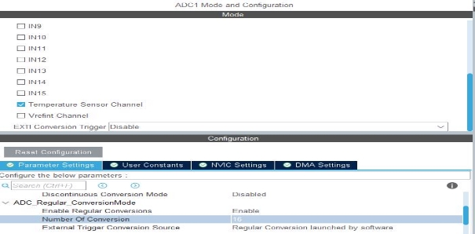
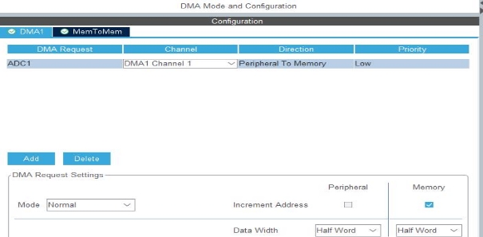
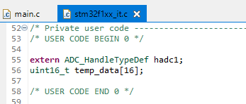
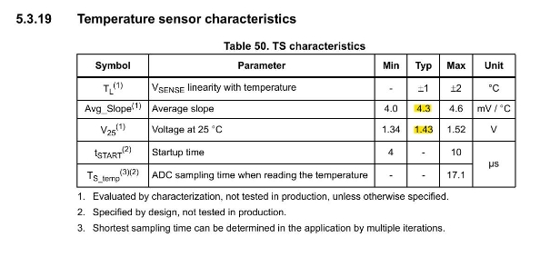
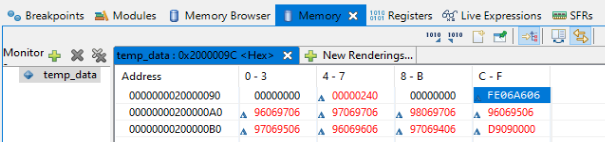



- We don't want to increment the peripheral. Because there is only one data registers. 
- So, we cannot increment that. But memory? Yes, it should be incremented by Half Word. Because the resolution is 12 bit. We have selected12 bit resolution.  
- So, 12 bit means we have to use Half word in order to store that data.
- We cannot use a byte to store 12 bit. We have to use short or short int or two bytes. That we alsocall as Half word in order to store that 12 bit.So, that means now DMA will copy Half word by Half word not byte by byte. 

- To use the handler in another place, we declare it as `extern` where we want to use it. 
- Each conversion is 12 bit. so uint16\_t is enough to store it.
- Size is 16, because we are doing 16 conversions.

The values for AVG\_Slope and V\_25 have standard values. These values are provided in the datasheet. 

**Hexadecimal Value**: "FE06A606" 

Using a 12-bit ADC (Analog-to-Digital Converter), we need to interpret the "FE06A606" hexadecimal value. However, this value seems quite long and appears to represent a 32 - bit value. Remember, a 12-bit ADC data has a maximum value of 0xFFF (4095). In this 

case, we only need to use the 12-bit data. 

To find the temperature using the given formula:

Temperature (in °C) = {(V25 - VSENSE) / Avg\_Slope} + 25. 

where VSENSE is derived from the ADC value. Each conversion is 12-bit. 

**Steps:** 

1. **Extract the ADC value:** 

`   `The first 12 bits of the hexadecimal value "FE0" represent the ADC value in a 12-bit format. 

2. **Convert Hex to Decimal:** 

\- Hexadecimal "FE0" is equivalent to the decimal value 4064.

3. **Calculate VSENSE:** 

`   `Assuming the reference voltage (VREF) is 3.3V, the VSENSE can be calculated as:    VSENSE = ( ADC\_value  / 4096 ) x V\_REF) 

`   `VSENSE = ( 4064 / 4096 ) x 3.3V = 3.275V 

4. **Calculate Temperature:** 

`   `Using the given formula: 

`   `Temperature (in °C)} = ( ( 1.43 - 3.275 ) / 4.3) + 25  = 24.57°C  

So, the temperature is approximately 24.57°C, calculated using the formula and the extracted 12-bit ADC value from the hexadecimal data. 
