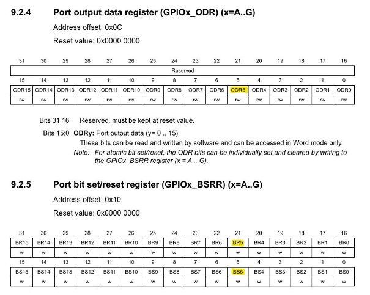
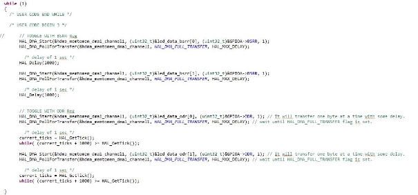
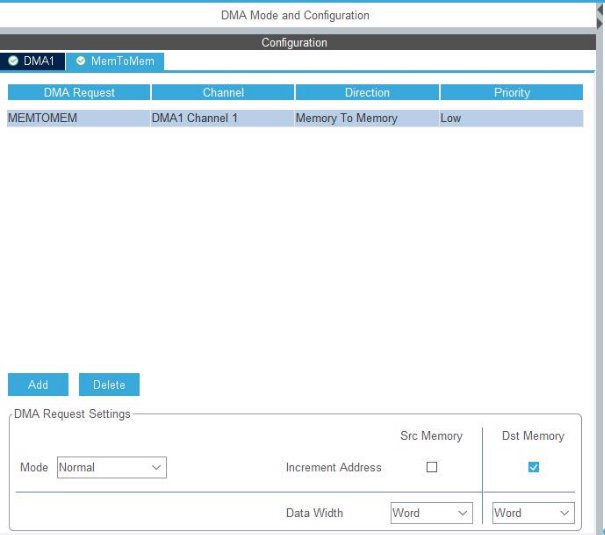

- Firstly, you need to check your reference manual. I'm using the STM32F103RB developer board. We can toggle the LED by using the BSRR or ODR 

  registers. 

- Secondly, you need to know the values for the interested port bit to set. I need 0x20 to set the fifth bit. 

  uint32\_t led\_data[2] = {0x20, 0x00}; 

- Finally, here's how you can use the ODR and BSRR registers:

- To toggle with BSRR, set data width as word. 

